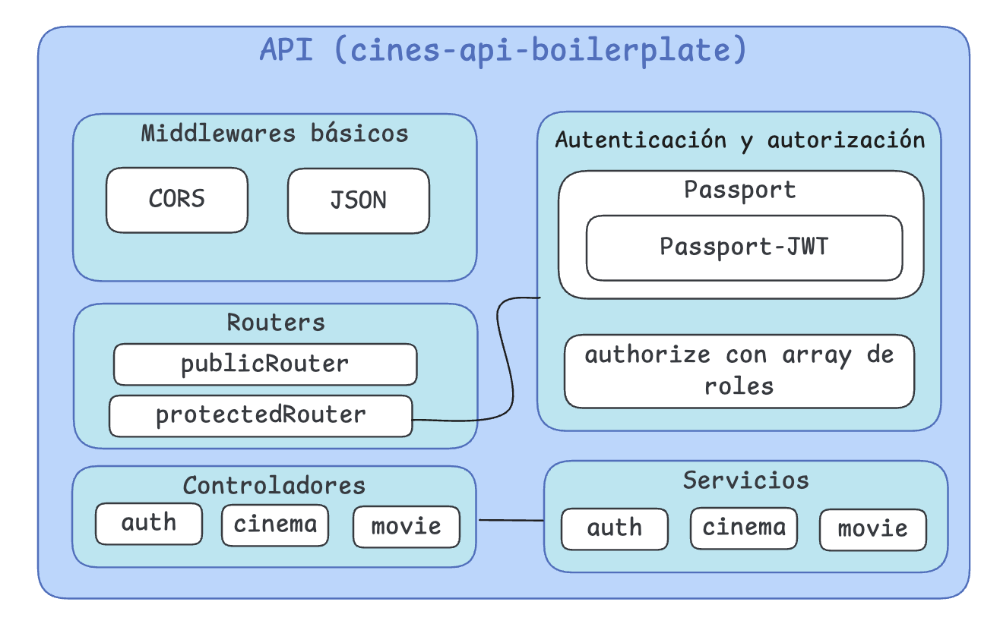

# Cines API Boilerplate - PSE 2026

Este repositorio contiene un *boilerplate* o plantilla inicial para construir una API REST con el *stack* tecnológico final que utilizaremos en la asignatura. La plantilla contiene lo realizado a nivel *backend* durante los **Laboratorios 1 - 5 de la asignatura**, es decir:

- Inicialización de la API con **Express** + **TypeScript**
- Implementación de la **persistencia** con Prisma, de forma limpia para que el cliente se genere en `node_modules` en lugar de una carpeta generated.
- Implementación de la **autenticación** con Passport y JWT y de un **middleware *custom** para manejar la autorización.
- Organización de carpetas siguiendo la **arquitectura por capas**, el patrón ***Domain-Driven Design*** y el patrón de diseño de APIs *Routes-Controllers-Services*
- *Middlewares de enrutamiento* para rutas públicas y rutas privadas
- Tipados y DTOs de forma profesional
- Validación sencilla (sin middlewares)
- **Todo el código comentado** 

Expone dos endpoints:

- `POST /cinemas`, que devuelve la lista de cines en base al filtrado pasado por *body*.
- `POST /movies`, que devuelve la lista de películas en base al filtrado pasado por *body*.

## Arquitectura

## Uso

1. Clonar el repositorio y `npm install` para instalar las dependencias
2. `npm run start` para ejecutar el servidor